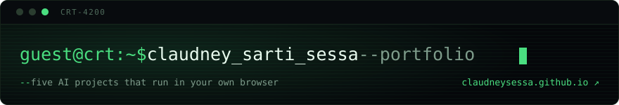

# Claudney Sarti Sessa

Bachelor's in Information Systems, with **over 20 years of experience** in ERP and
systems built around Brazilian tax legislation — especially **electronic fiscal
documents**. It is a domain that does not forgive mistakes: one wrong tax rule
means contingency mode, fines and real losses for whoever depends on the system.

I am **a senior developer** and I program in **Delphi, Flutter and .NET**, and I
work with **applied AI and prompt engineering**.

## Portfolio

Personal projects with one common thread: **inference runs in the visitor's own
browser**. No AI server, no account, no data leaving the device. All of them have
a live demo and open source code.

**→ <https://claudneysessa.github.io/>**

The portfolio is the single place where the project list lives, so it never
disagrees with itself.

## Stack

**Delphi / Object Pascal** and **.NET** for the ERP and fiscal systems where most
of my two decades went. **Dart / Flutter** for mobile. **JavaScript, TypeScript,
HTML and CSS** on the web, which is where the AI experiments live.

Most of that experience is in private corporate repositories, so it does not show
up in this profile's language statistics.

## Education

- **Software Engineering with Applied AI** — postgraduate, in progress
- **Software Engineering** — postgraduate
- **Big Data and Analytics** — postgraduate
- **Information Systems** — BSc, FAESA

## Where to find me

[linkedin.com/in/claudneysessa](https://www.linkedin.com/in/claudneysessa/) ·
[medium.com/@claudneysartisessa](https://medium.com/@claudneysartisessa) ·
[claudneysartisessa@gmail.com](mailto:claudneysartisessa@gmail.com)

---

<b>🇧🇷 Versão em português</b>

 

Bacharel em Sistemas de Informação, com **mais de 20 anos de experiência** em ERP
e em sistemas voltados à área fiscal brasileira — com destaque para **documentos
eletrônicos**. É um domínio que não perdoa erro: regra fiscal errada gera
contingência, autuação e prejuízo real para quem depende do sistema.

Sou **desenvolvedor sênior** e programo em **Delphi, Flutter e .NET**, e atuo com
**IA aplicada e engenharia de prompts**.

### Portfólio

Projetos autorais com um fio condutor: **a inferência roda no navegador de quem
visita**. Sem servidor de IA, sem conta, sem enviar dados para fora do
dispositivo. Todos têm demonstração ao vivo e código aberto.

**→ <https://claudneysessa.github.io/?lang=pt>**

O portfólio é o único lugar onde a lista de projetos vive, então ela nunca
discorda de si mesma.

### Stack

**Delphi / Object Pascal** e **.NET** nos sistemas de ERP e fiscal onde foi a
maior parte das duas décadas. **Dart / Flutter** no mobile. **JavaScript,
TypeScript, HTML e CSS** na web, que é onde vivem os experimentos de IA.

A maior parte dessa experiência está em repositórios corporativos privados, então
não aparece nas estatísticas de linguagem deste perfil.

### Formação

- **Engenharia de Software com IA Aplicada** — pós-graduação, em andamento
- **Engenharia de Software** — pós-graduação
- **Big Data e Analytics** — pós-graduação
- **Sistemas de Informação** — bacharelado, FAESA

### Onde me encontrar

[linkedin.com/in/claudneysessa](https://www.linkedin.com/in/claudneysessa/) ·
[medium.com/@claudneysartisessa](https://medium.com/@claudneysartisessa) ·
[claudneysartisessa@gmail.com](mailto:claudneysartisessa@gmail.com)

